# Tools Introduction

## Requirements

- Must have **Anaconda/Miniconda** installed
  > Download link: <https://www.anaconda.com/download/success>
- Must hove **VSCode** installed
  > Download link: <https://code.visualstudio.com/download>
- Must have **Git** installed
  > Download link: <https://git-scm.com/downloads>

## What we'll cover

- Terminal
- Conda
- VSCode
- Git

## Terminal

- Essentials command:

  - Display folder contents

    - Mac/Linux

      ```bash
      ls
      ```

    - Windows

      ```bash
      dir
      ```

  - Change folder location

    ```bash
    cd folder_name

    # or
    cd path/to/folder_name

    # return to parent folder
    cd ..
    ```

    - Mac/Linux

      > **lokasi folder**: `/User/Documents/ProjectA`

      ```text
      User
      └── Documents
          └── ProjectA
      ```

      ```bash
      # Jika lokasi cursor berada di dalam /User/Documents
      cd ProjectA

      # Jika lokasi cursor berada di luar
      cd /User/Documents/ProjectA
      ```

    - Windows

      > **lokasi folder**: `C:\Users\Documents\ProjectA`

      ```text
      C:
      └── User
          └── Documents
              └── ProjectA
      ```

      ```bash
      # Jika lokasi cursor berada di dalam /User/Documents
      cd ProjectA

      # Jika lokasi cursor berada di luar
      cd C:\Users\Documents\ProjectA
      ```

  - Create new folder

    ```bash
    mkdir folder_name

    # or
    mkdir path/to/folder_name
    ```

### Terminal Exercise

> Please open: <https://www.terminaltemple.com/> and answer these questions below

1. Write command for changing location to `/home/terminal/Downloads`
2. Write command for changing location to `/usr`
3. Write command for creating a new folder, called `ProjectA`, in `/home/terminal`

## Conda

- Conda is a special command from installing **Anaconda/Miniconda**
- Conda can be used for:
  - Environment Management
  - Package Management
- To verify `conda`, write down the command below in your **Terminal**

  ```bash
  conda --version
  ```

  > If encounter an error, please ask the instructor for help.

- TLDR, you can skip over to the [Mandatory Conda Setup](#mandatory-conda-setup) section.

### Environment

- To give a visual understanding, please see the illustration below
  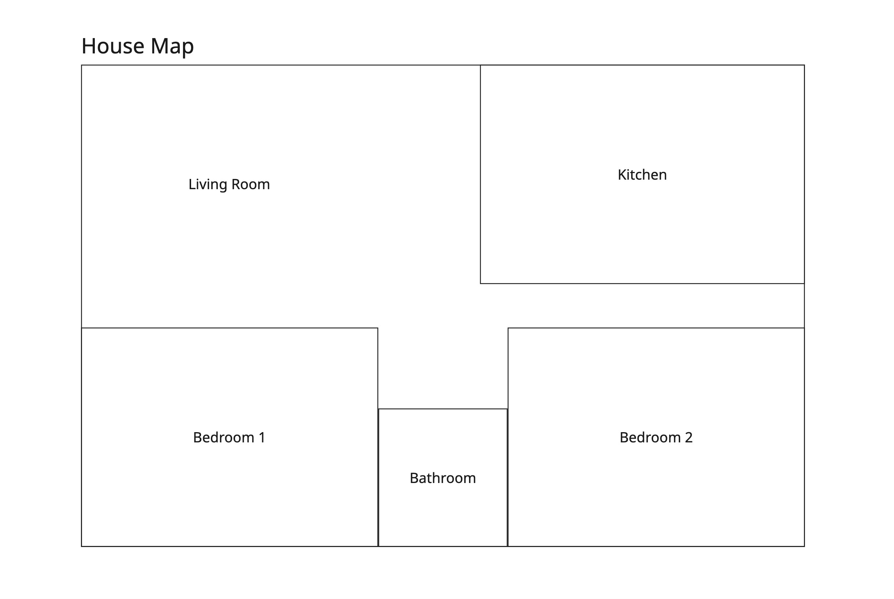

- Environment is an "isolated space" that separates specific activities from conflicting with each other.
- Let's say this **House Map** is a global space which have several rooms inside. Each rooms has a specific name written on it.
- Ideally, we can only do certain activities in certain room, like **taking a bath** in the **Bathroom**, or **cooking** in the **Kitchen**.
- But, there are also some activities that don't require specific room to do it, like **sleeping on the couch** in the **Living Room** while we already have **Bedroom** to do this.
- So, we can conclude that we can do certain activities based on the **Environment** that we are in, as long as the **Environment** got everything that we need to do it. In this illustration, "Room name" IS the **Environment**.

- Another thing to note is that **Environment** doesn't tied to any Physical location. We can **sleep** basically anywhere in the house as long as we got everything we need to **sleep**, on a couch, on the floor, under the table, doesn't matter!

### Environment Management

- Conda can be used for:

  - Create/Remove environment

    ```bash
    # create new environment
    conda create --name environment_name

    # remove existing environment
    conda remove --name environment_name --all
    ```

  - Display list of existing environment

    ```bash
    conda env list
    ```

  - Activate/Deactivate environment

    ```bash
    # activate environment
    conda activate environment_name

    # deactivate environment
    conda deactivate
    ```

### Package Management

- Conda can be used for:

  - Installing/Removing package

    ```bash
    # install
    conda install package_name

    # remove
    conda remove package_name
    ```

  - Display list of installed packages

    ```bash
    conda list
    ```

### Mandatory Conda Setup

- Please download the required file in this [link here](my_env.yml)
- Open up your **Terminal** and write down the following command

  ```bash
  # before execute, PLEASE CHECK your cursor location first.
  # If the file is not in the same location as your cursor, then you MUST change location first before continuing to execute below command.
  conda env create -f file_name.yml
  ```

  > If encounter any errors, please ask the instructor for help.

- After finished, activate the new environment with this command

  ```bash
  conda activate environment_name
  ```

## VSCode

- Essentials features:
  - Open project folder
    - Choose `Open Folder` > Select your desired folder > then `Open`
      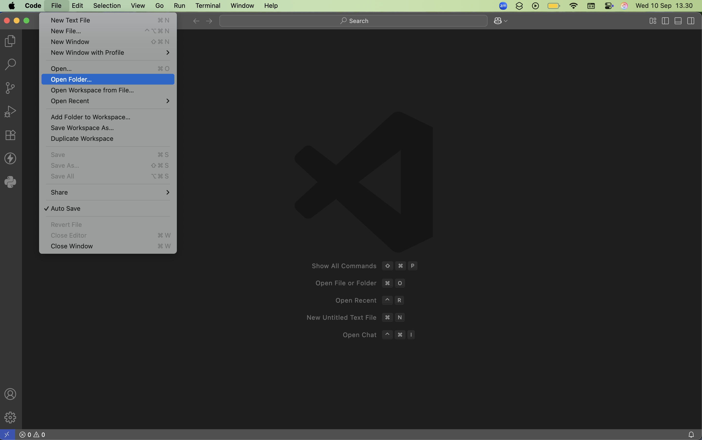
  - Integrated Terminal
    - Choose `Terminal` > `New Terminal`
      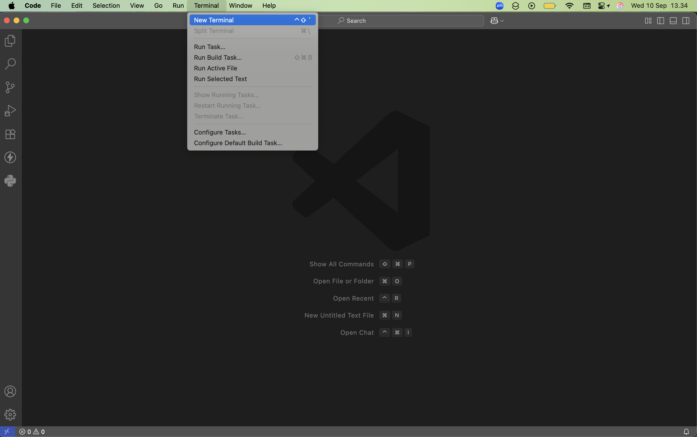
      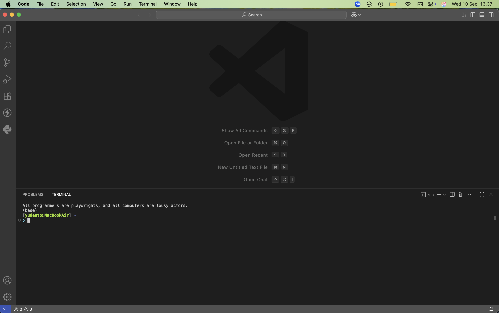
    - **FOR WINDOWS USER**, please setup your default profile into `CMD` (Command Prompt) first before continuing.
      1. Click the top **Search Bar**, then type and select `> Terminal: Select Default Profile`
         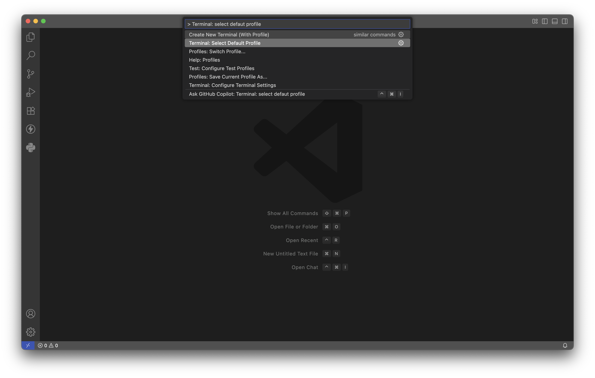
      2. Choose `CMD` or `Command Prompt`
         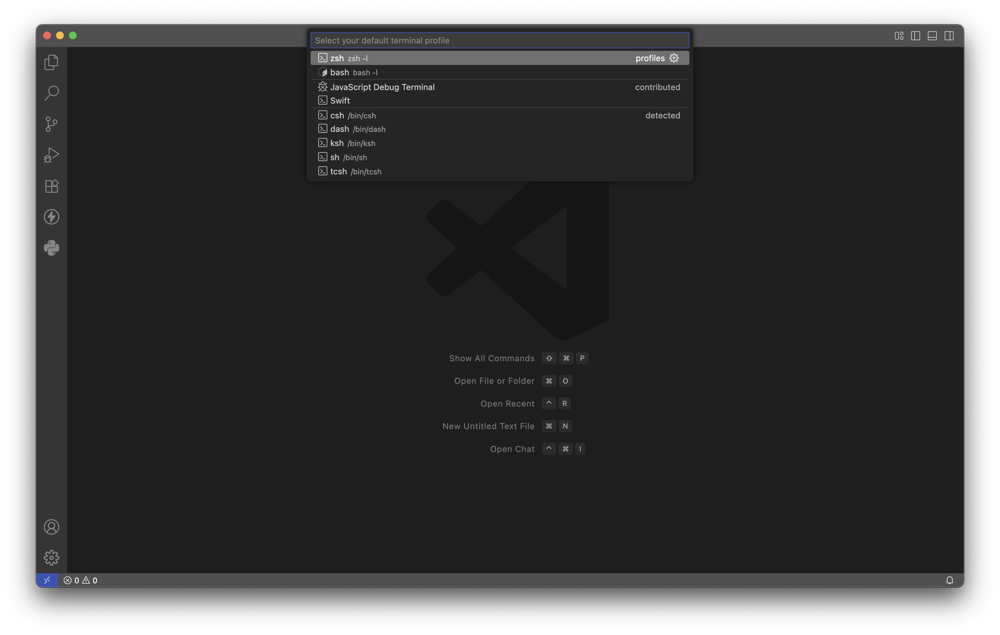

### VSCode Exercise

1. Open new project folder and create a new file called `my_app.py`

   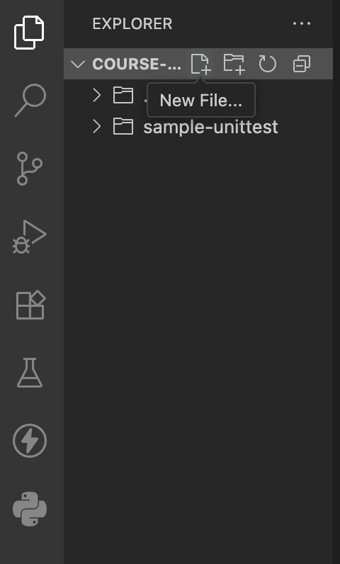

2. Create 2 more files called `my_notes.ipynb` and `my_markdown.md`
3. In `my_app.py` write down the below code

   ```py
   print("Hello World")
   ```

   > Don't forget to save the files with <kbd>Ctrl</kbd>+<kbd>S</kbd> (Windows/Linux) or <kbd>Command</kbd>+<kbd>S</kbd> (MacOS)

4. Open up the **Integrated Terminal** and make sure:

   - Make sure that your **cursor location** is at the **current folder**
   - Make sure that your active environment is `my_env`
     > Please refer to [Mandatory Conda Setup](#mandatory-conda-setup) section

5. Now in your Terminal, type and enter `python file_name.py` and you should see `"Hello World"` output.

   > If you have any questions/errors, please ask the instructor for help

6. Next, in `my_notes.ipynb` add 1 `Markdown/Text` cell and 1 `Code` cell.

   1. In the `Markdown/Text` cell, write down the following

      ```text
      # This is my Notebook

      - Name: your_name
      - Location: your_location
      ```

   2. Press the ✅ button on your `Markdown/Text` cell to see the **Preview**
      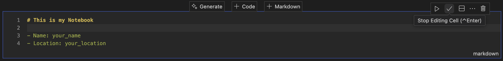

   3. Now, in your `Code` cell, write down the following code

      ```py
      print("hello world")
      ```

   4. Press the `Run` button on your `Code` cell to see the **Output**

      > Please make sure to set your language mode to `Python` first!
      > 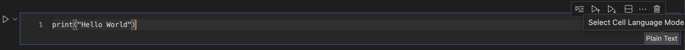

   5. When prompted **Select Kernel**, choose `Python Environment` > select `my_env` environment`.
      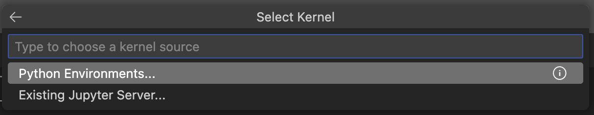
   6. Now your should see the **output** from the `Code` cell. You can save the file as well.
      > If you have any questions/errors, please ask the instructor for help

7. Finally, in `my_markdown.md`, write down the following text

   ```text
   # This is my Markdown

   - Name: your_name
   - Location: your_location
   ```

8. Save the file, then right-click on `my_markdown.md` > `Open Preview`. You should see the **Preview** of your markdown file (`.md` file)

## Git

- Verify `git` command

  ```bash
  git -v
  ```

  > If encounter any errors, please ask the instructor for help

### Mandatory Git Setup

Please execute down the following commands

1. Git config user.name

   ```bash
   git config --global user.name "your_github_username"
   ```

2. Git config user.email

   ```bash
   git config --global user.email "your_github_email"
   ```

### Git Exercise

1. Create new repository on <https://github.com>
2. Copy your repository URL here
   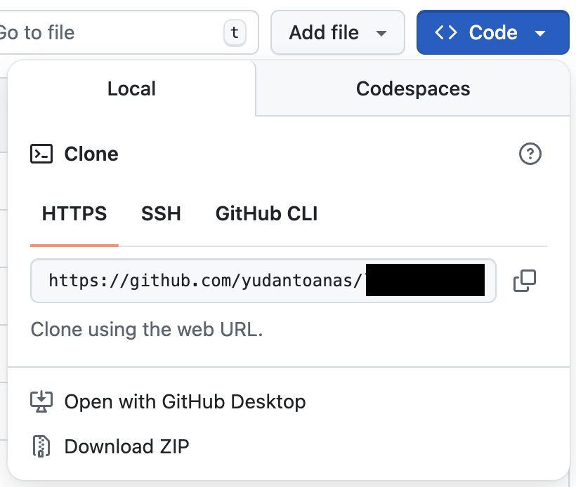
3. Open **Terminal**
   > (_OPTIONAL_) Perform `cd` to your desired location
4. Execute the command below

   ```bash
   git clone your_repository_url
   ```

   > This command will create a **new folder** inside your specific location
   > If encounter any errors, please ask the instructor for help

5. Now, open up your cloned folder from `Step 4` in VSCode
6. Next, open the **Integrated Terminal** in VSCode and write down the following commands:

   1. Git add

      ```bash
      git add .
      ```

   2. Git commit

      ```bash
      git commit -m "your_commit_message"
      ```

   3. Git push

      ```bash
      git push
      ```

   > If encounter any errors, please ask the instructor for help
